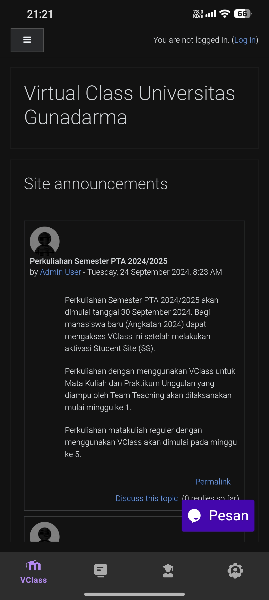

# Gunadarma Web

A mobile app that renders frequently accessed Gunadarma websites.

## Screenshots

 

 


## Download

[Download Latest](https://github.com/get543/gunadarmaweb/releases/latest)

## Supported Websites

- v-class.gunadarma.ac.id
- praktikum.gunadarma.ac.id
- studentsite.gunadarma.ac.id
- baak.gunadarma.ac.id

## Features

- Light/Dark mode
- Material design
- Renders web pages in-app
- All web features working as expected (PiP mode, downloads, uploads, etc.))

## Installation / Build Instructions

1. Clone the repo
```bash
git clone https://github.com/get543/gunadarmaweb.git
```
2. Open with Android Studio

3. Build and run on an emulator or physical device


## TODO

- Add more websites, these are just examples, more should be added
    - [ ] lepkom.gunadarma.ac.id
    - [ ] praktikum-iflab.gunadarma.ac.id

- Better UI/UX
    - [ ] Home screen with website list, with categories ?
    - [ ] Add splash screen
    - [ ] Customizable settings for navigation bar ?

## License

This project is licensed under the GNU General Public License Version 3 - see the [LICENSE](LICENSE) file for details